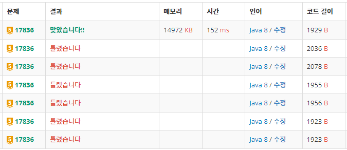

# 공주님을 구해라!

[17836번: 공주님을 구해라!](https://www.acmicpc.net/problem/17836)


---

그람이 없을 때에는 1이면 이동할 수 없지만 그람이 있을 때에는 1에도 이동할 수 있다.

방문관리를 따로 해줘야하는 게 핵심인 것 같다.

(왜냐면 내가 따로 안해줘서 틀렸으니까 😂)

좌표와 이동시간, 그람유무를 node로 들고 다니면서 bfs를 돌렸다.

- 그람이 없을 때
    - 그람이 없는 공간에서 방문했거나 좌표값이 1이면 continue;
    - 좌표값이 2이면 그람이 있는 상태로 변경
- 그람이 있을 때
    - 그람이 있는 공간에서 방문했으면 continue;
    - 
- 공통적으로
    - 그람에 따른 방문 처리
    - 큐에 좌표, 시간+1, 변경된 그람유무 추가

- 현재 좌표가 공주님 좌표이면
    - 현재 시간 반환
- 만약 공주좌표를 못 거치고 끝났다면
    - -1 반환 ⇒ Fail 출력
    

---

```java
import java.io.BufferedReader;
import java.io.IOException;
import java.io.InputStreamReader;
import java.util.LinkedList;
import java.util.Queue;
import java.util.StringTokenizer;

public class Main {
	static class Node{
		int r, c, time, gram;
		public Node(int r, int c, int time, int gram) {
			this.r = r;
			this.c = c;
			this.time = time;
			this.gram = gram;
		}
	}
	static int N, M, T, castle[][], test[][];
	static int[] dr = {-1, 0, 1, 0};
	static int[] dc = {0, 1, 0, -1};
	static boolean visited[][][];
	public static void main(String[] args) throws IOException {
		BufferedReader br = new BufferedReader(new InputStreamReader(System.in));
		StringTokenizer st = new StringTokenizer(br.readLine());
		N = Integer.parseInt(st.nextToken());
		M = Integer.parseInt(st.nextToken());
		T = Integer.parseInt(st.nextToken());
		castle = new int[N][M];
		test = new int[N][M];
		visited = new boolean[N][M][2];
		for (int r = 0; r < N; r++) {
			st = new StringTokenizer(br.readLine());
			for (int c = 0; c < M; c++) {
				castle[r][c] = Integer.parseInt(st.nextToken());
			}
		}
		int time = bfs();
		if(time == -1) {
			System.out.println("Fail");
		}else {
			System.out.println(time);
		}
	}
	private static int bfs() {
		Queue<Node> q = new LinkedList<>();
		
		visited[0][0][0] = true;
		q.offer(new Node(0, 0, 0, 0));
		while(!q.isEmpty()) {
			Node cur = q.poll();
			if(cur.time > T) break;
			if(cur.r == N-1 && cur.c == M-1) {
				return cur.time;
			}
			for (int d = 0; d < 4; d++) {
				int nr = cur.r + dr[d];
				int nc = cur.c + dc[d];
				int isGram = cur.gram;
				if(0>nr || nr>=N || 0>nc || nc>=M) continue;
				if(isGram == 0) {
					if(visited[nr][nc][0] || castle[nr][nc] == 1) continue;
					if(castle[nr][nc] == 2) isGram = 1;
				}else {
					if(visited[nr][nc][1]) continue;
				}
				visited[nr][nc][isGram] = true;
				q.offer(new Node(nr, nc, cur.time+1, isGram));
			}
		}
		return -1;
	}
}
```



수많은 시행착오의 흔적……