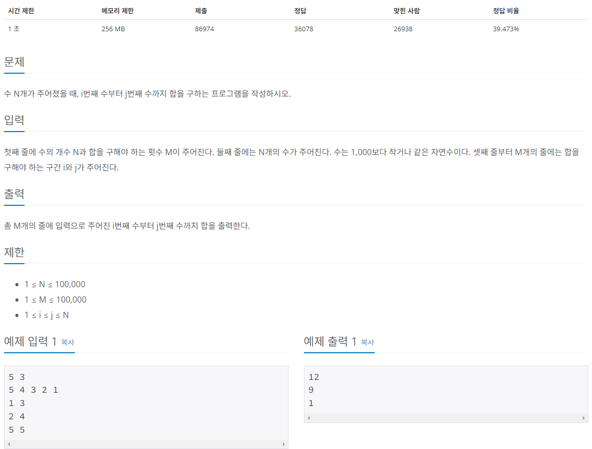
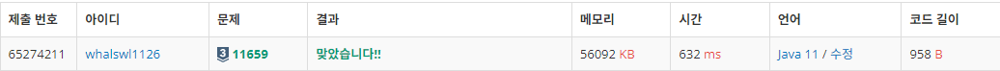

# 구간 합 구하기 4



---

처음엔 단순하게 배열에 입력받은 숫자를 저장한 후

i번부터 j번까지 더하는 코드를 작성했으나 시간 초과로 실패하였다.

이후 입력받은 숫자를 배열에 저장할 때 누적합 배열도 같이 저장한 후

j번째 누적 합에서 (i-1)번째 누적 합을 빼는 식으로 코드를 수정한 후 성공하였다.

---

```java
import java.io.BufferedReader;
import java.io.IOException;
import java.io.InputStreamReader;
import java.util.StringTokenizer;

public class Main_11659_구간합구하기4 {
	public static void main(String[] args) throws IOException {
		BufferedReader br = new BufferedReader(new InputStreamReader(System.in));
		StringTokenizer st = new StringTokenizer(br.readLine());
		StringBuilder sb = new StringBuilder();
		
		int N = Integer.parseInt(st.nextToken());
		int M = Integer.parseInt(st.nextToken());
		
		int[] nums = new int[N+1];
		int[] sum = new int[N+1];
		st = new StringTokenizer(br.readLine());
		for (int i = 1; i <= N; i++) {
			nums[i] = Integer.parseInt(st.nextToken());
			sum[i] = sum[i-1] + nums[i];
		}
		
		for (int m = 0; m < M; m++) {
			st = new StringTokenizer(br.readLine());
			int i = Integer.parseInt(st.nextToken()) - 1;
			int j = Integer.parseInt(st.nextToken());
			sb.append(sum[j] - sum[i]).append("\n");
		}
		System.out.println(sb.toString());
	}
}
```

---



---

- 실패한 코드
    
    ```java
    import java.io.BufferedReader;
    import java.io.IOException;
    import java.io.InputStreamReader;
    import java.util.StringTokenizer;
    
    public class Main {
    	public static void main(String[] args) throws IOException {
    		BufferedReader br = new BufferedReader(new InputStreamReader(System.in));
    		StringTokenizer st = new StringTokenizer(br.readLine());
    		
    		int N = Integer.parseInt(st.nextToken());
    		int M = Integer.parseInt(st.nextToken());
    		
    		int[] nums = new int[N];
    		st = new StringTokenizer(br.readLine());
    		for (int i = 0; i < N; i++) {
    			nums[i] = Integer.parseInt(st.nextToken());
    		}
    		
    		for (int m = 0; m < M; m++) {
    			st = new StringTokenizer(br.readLine());
    			int i = Integer.parseInt(st.nextToken()) - 1;
    			int j = Integer.parseInt(st.nextToken());
    			int sum = 0;
    			for (int k = i; k < j; k++) {
    				sum += nums[k];
    			}
    			System.out.println(sum);
    		}
    	}
    }
    ```
