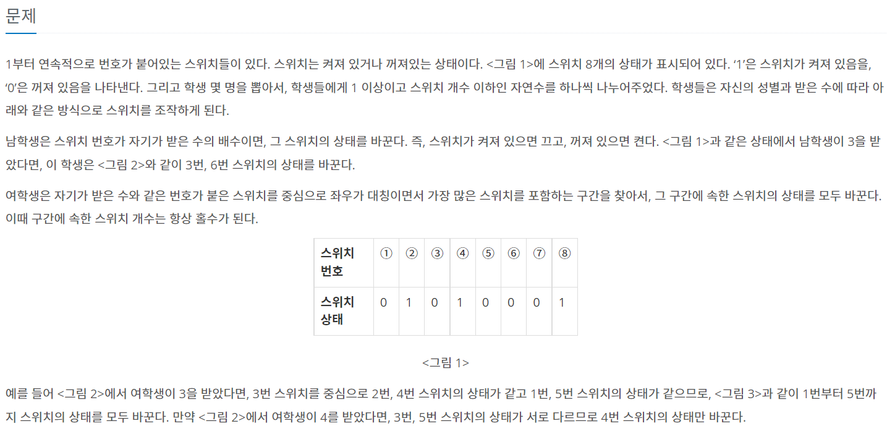
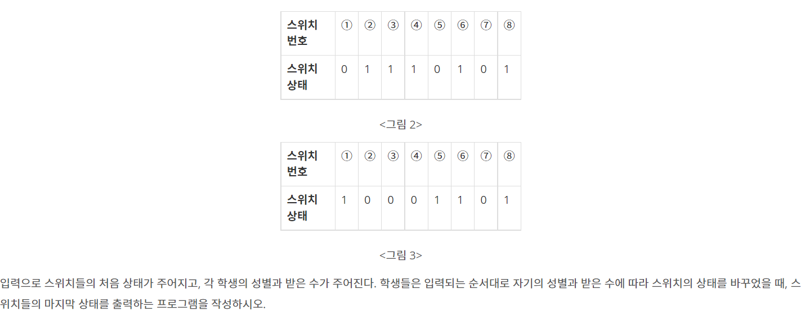
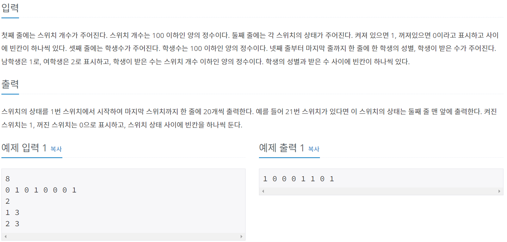
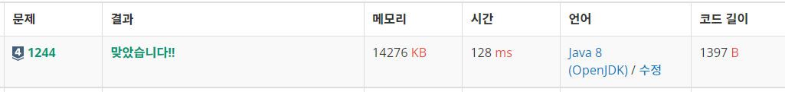

# 스위치 켜고 끄기





---



---

- 남자였을 때는 반복문을 돌려서 주어진 숫자와 나누었을 때 나머지가 0인 부분을 바꿔준다.

- 여자였을 때는 일단 주어진 숫자 위치를 바꾸고 그 숫자 양쪽의 크기를 비교해서 최소인 숫자를 가지고 범위를 정한다.
- 반복문으로 그 범위 내에서 양쪽 값이 같을 때 바꿔준다.
- 이 때 같지 않다면 break를 걸어서 빠져 나와줘야 한다.( 이 부분을 안해줘서 애를 먹었다ㅠ)

- 바꿔줄 때에는 기존 값에서 1을 뺀 절댓값으로 0과 1을 바꿔준다.

---

```jsx
import java.io.BufferedReader;
import java.io.IOException;
import java.io.InputStreamReader;
import java.util.StringTokenizer;

public class Main_1244_스위치켜고끄기 {
	static int N, sw[], M;
	public static void main(String[] args) throws NumberFormatException, IOException {
		BufferedReader br = new BufferedReader(new InputStreamReader(System.in));

		N = Integer.parseInt(br.readLine());
		sw = new int[N+1];
		StringTokenizer st = new StringTokenizer(br.readLine());
		for (int i = 1; i <= N; i++)
			sw[i] = Integer.parseInt(st.nextToken());

		M = Integer.parseInt(br.readLine());
		for (int i = 0; i < M; i++) {
			st = new StringTokenizer(br.readLine());
			int gender = Integer.parseInt(st.nextToken());
			int num = Integer.parseInt(st.nextToken());

			if(gender == 1) {
				male(num);
			}else {
				female(num);
			}
		}

		for (int i = 1; i <= N; i++) {
			System.out.print(sw[i] + " ");
			if(i%20 == 0)
				System.out.println();
		}

	}

	public static void female(int num) {
		changeStatus(num);
		int scope = Math.min(num-1, N-num);
		for (int i = 1; i <= scope; i++) {
			if(sw[num-i] == sw[num+i]) {
				changeStatus(num-i);
				changeStatus(num+i);
			}else {
				break;
			}
		}
	}

	public static void male(int num) {
		for (int i = 1; i <= N; i++) {
			if(i%num == 0)
				changeStatus(i);
		}
	}

	public static void changeStatus(int num) {
		sw[num] = Math.abs(sw[num]-1);
	}
}
```

---


