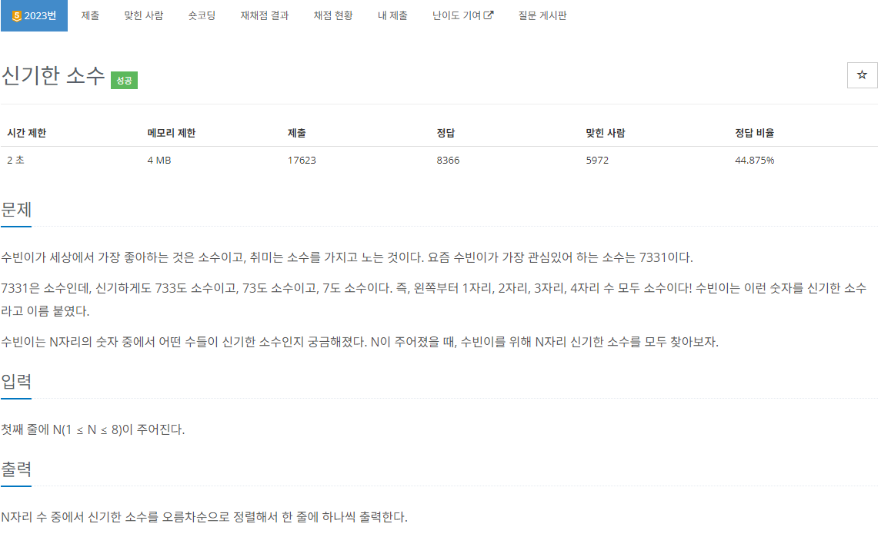
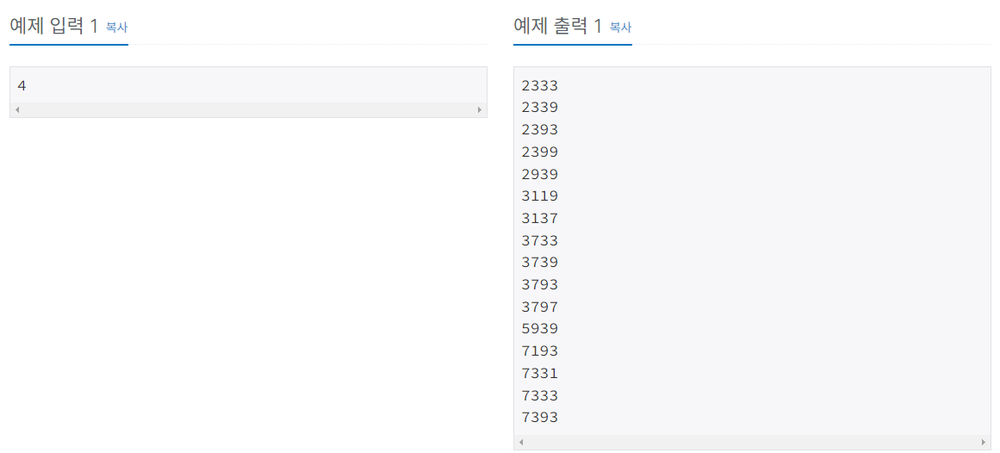
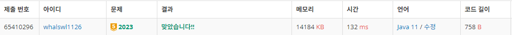

# 신기한 소수

> 백트래킹





---

N자리 소수가 될 수 있는 규칙을 먼저 찾았다.

먼저 한자리 수 중 소수가 될 수 있는 수는 2, 3, 5, 7뿐이니 맨 앞자리에 올 수 있는 숫자는 2, 3, 5, 7뿐이다.

이 후 소수가 될 수 있는 숫자는 1, 3, 7, 9이므로 4가지 숫자의 경우의 수를 계산하며 소수를 판별하는 코드를 구현하였다.

---

```java
import java.io.BufferedReader;
import java.io.IOException;
import java.io.InputStreamReader;

public class Main_2023_신기한소수 {
	public static void main(String[] args) throws IOException {
		BufferedReader br = new BufferedReader(new InputStreamReader(System.in));
		int N = Integer.parseInt(br.readLine());

		// 오름차순
		chk(2, N - 1);
		chk(3, N - 1);
		chk(5, N - 1);
		chk(7, N - 1);
	}
	private static void chk(int num, int cnt) {
		// N자리 수라면
		if(cnt == 0) {
			System.out.println(num);
			return;
		}
		int[] nums = {1, 2, 3, 7, 9};
		for (int n : nums) {
			int sosu = num * 10 + n;
			if(isPrime(sosu))
				chk(sosu, cnt - 1);
		}
	}
	// 소수인지 판별하는 함수
	private static boolean isPrime(int num) {
		for (int i = 2; i <= Math.sqrt(num); i++) {
			if(num % i == 0)
				return false;
		}
		return true;
	}
}
```

---


