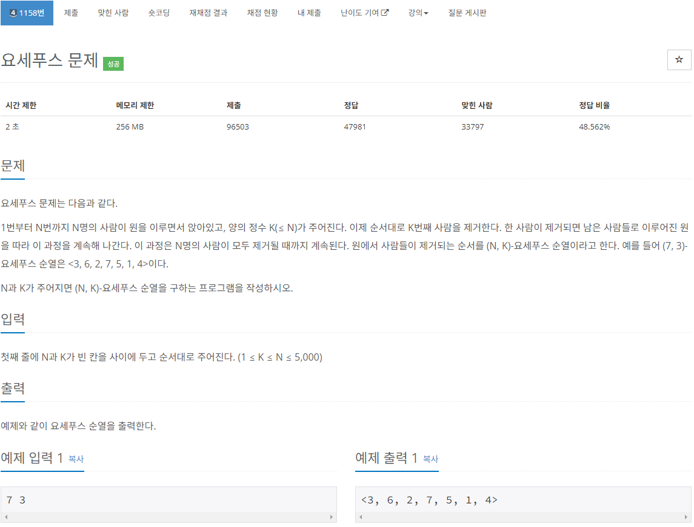
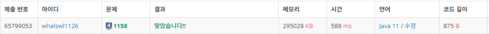

# 요새푸스 문제

[URL](https://www.acmicpc.net/problem/1158)

> 구현, 자료 구조, 큐



---

원을 이루면서 동작하니 큐를 이용해서 풀어야 하는 문제이다.

K번째가 오기 전까지는 큐의 앞 숫자들을 다시 추가하고

K번째에는 큐에서 해당 숫자를 뺀 뒤 결과값에 추가한다.

큐가 빌 때까지 반복한다.

---

```java
import java.io.BufferedReader;
import java.io.IOException;
import java.io.InputStreamReader;
import java.util.LinkedList;
import java.util.Queue;
import java.util.Stack;
import java.util.StringTokenizer;

public class Main_1158_요세푸스문제 {
	public static void main(String[] args) throws IOException {
		BufferedReader br = new BufferedReader(new InputStreamReader(System.in));
		StringTokenizer st = new StringTokenizer(br.readLine());
		StringBuilder sb = new StringBuilder();
		Queue<Integer> queue = new LinkedList<>();

		int N = Integer.parseInt(st.nextToken());
		int K = Integer.parseInt(st.nextToken());

		for (int i = 0; i < N; i++)
			queue.add(i + 1);
		sb.append("<");
		while(!queue.isEmpty()) {
			for (int i = 1; i < K; i++) {
				queue.add(queue.poll());
			}
			sb.append(queue.poll()).append(", ");
		}
		System.out.printf("%s>", sb.substring(0, sb.length()-2));
	}
}
```

---



---

- 이전 풀이

  ```java
  import java.io.BufferedReader;
  import java.io.BufferedWriter;
  import java.io.IOException;
  import java.io.InputStreamReader;
  import java.io.OutputStreamWriter;
  import java.util.LinkedList;
  import java.util.Queue;
  import java.util.StringTokenizer;

  public class Main {
  	public static void main(String[] args) throws IOException {
  		BufferedReader br = new BufferedReader(new InputStreamReader(System.in));
  		BufferedWriter bw = new BufferedWriter(new OutputStreamWriter(System.out));
  		StringTokenizer st = new StringTokenizer(br.readLine());
  		StringBuilder sb = new StringBuilder();
  		int N = Integer.parseInt(st.nextToken());
  		int K = Integer.parseInt(st.nextToken());

  		Queue<Integer> q = new LinkedList<>();
  		for (int i = 1; i <= N; i++)
  			q.offer(i);

  		sb.append("<");
  		while (q.size() > 1) {
  			for (int i = 0; i < K-1; i++) {
  				q.offer(q.peek());
  				q.poll();
  			}
  			sb.append(q.poll() + ", ");
  		}
  		sb.append(q.poll() + ">");

  		bw.write(sb.toString());
  		bw.flush();
  		bw.close();
  	}
  }
  ```
