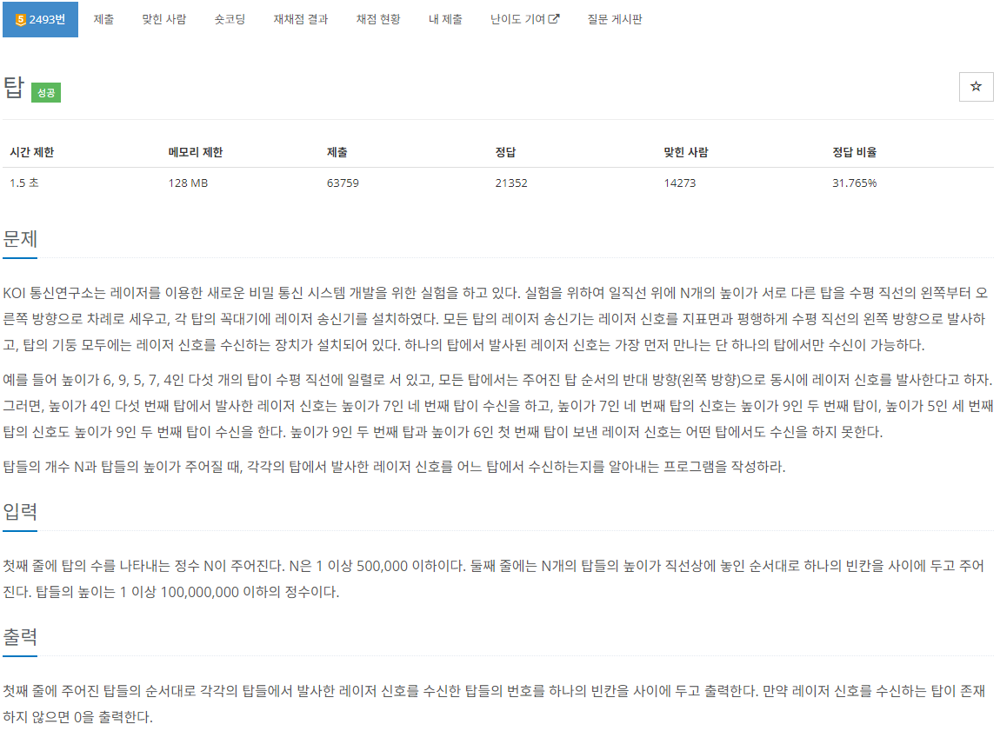
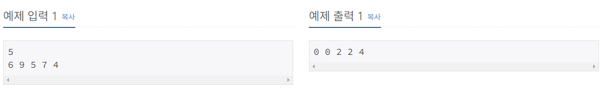
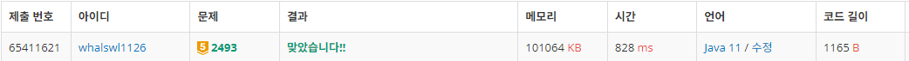

# 탑

[URL](https://www.acmicpc.net/problem/2493)

> 스택, 자료 구조





---

스택이 비어있으면 신호 수신을 못한 것이므로 0을 추가하고

있다면 스택의 높이들과 비교해서 높다면 수신 후 순서 추가

높지 않다면 스택에서 제외

---

```java
import java.io.BufferedReader;
import java.io.IOException;
import java.io.InputStreamReader;
import java.util.Stack;
import java.util.StringTokenizer;

public class Main_2493_탑 {
	static class Top {
		int idx, height;
		public Top(int idx, int height) {
			this.idx = idx;
			this.height = height;
		}
	}
	public static void main(String[] args) throws IOException {
		BufferedReader br = new BufferedReader(new InputStreamReader(System.in));
		StringBuilder sb = new StringBuilder();

		int N = Integer.parseInt(br.readLine());
		Stack<Top> tops = new Stack<>();

		StringTokenizer st = new StringTokenizer(br.readLine());
		for (int i = 1; i <= N; i++) {
			int height = Integer.parseInt(st.nextToken());

			while(!tops.isEmpty()) {
				if(tops.isEmpty()) {
					sb.append("0 ");
					tops.push(new Top(i, height));
				}

				Top top = tops.peek();

				if(top.height > height) { //신호 수신
					sb.append(top.idx + " ");
					break;
				} else { //신호 수신할 수 없는 탑은 제외
					tops.pop();
				}
			}
			if(tops.isEmpty()) {
				sb.append("0 ");
			}
			tops.push(new Top(i, height));
		}
		System.out.println(sb.toString());
	}
}
```

---


