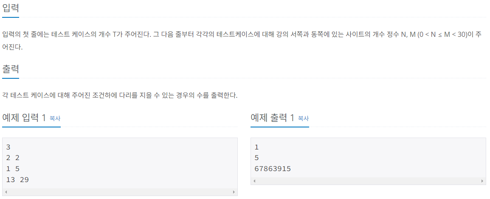
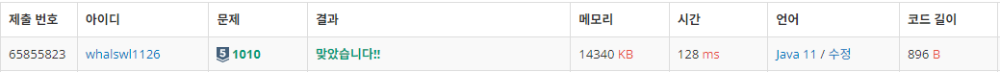

# 다리 놓기

[url](https://www.acmicpc.net/problem/1010)

> 다이나믹 프로그래밍, 수학, 조합




---

동쪽 사이트 개수(M)을 N, 서쪽 사이트 개수(N)를 R로 하는 조합을 구현하는 문제이다.

재귀를 활용하여 구현했더니 시간초과가 발생했다.

다이나믹 프로그래밍을 활용한 재귀를 활용하여야 하는 문제였다.

$_{n}C_{r} = _{n-1}C_{r-1} + _{n-1}C_{r}$

$_{n}C_{n} = _{n}C_{0} = 1$

---

```java
import java.io.BufferedReader;
import java.io.IOException;
import java.io.InputStreamReader;
import java.util.StringTokenizer;

public class Main_1010_다리놓기 {
	static int N, M;
	static int[][] numbers = new int[30][30];
	public static void main(String[] args) throws IOException {
		BufferedReader br = new BufferedReader(new InputStreamReader(System.in));
		StringTokenizer st;
		StringBuilder sb = new StringBuilder();

		int T = Integer.parseInt(br.readLine());
		for (int i = 0; i < T; i++) {
			st = new StringTokenizer(br.readLine());
			N = Integer.parseInt(st.nextToken());
			M = Integer.parseInt(st.nextToken());

			sb.append(comb(M, N)).append("\n");
		}
		System.out.println(sb.toString());
	}
	private static int comb(int n, int r) {
		if(n == r || r == 0)
			numbers[n][r] = 1;
		if(numbers[n][r] > 0)
			return numbers[n][r];
		return numbers[n][r] = comb(n-1, r-1) + comb(n-1, r);
	}
}
```

---



---

- 시간초과
  ```java
  import java.io.BufferedReader;
  import java.io.IOException;
  import java.io.InputStreamReader;
  import java.util.StringTokenizer;

  public class Main {
  	static int N, M, totalCnt;
  	static int[] numbers, input;
  	public static void main(String[] args) throws IOException {
  		BufferedReader br = new BufferedReader(new InputStreamReader(System.in));
  		StringTokenizer st;
  		StringBuilder sb = new StringBuilder();

  		int T = Integer.parseInt(br.readLine());
  		for (int i = 0; i < T; i++) {
  			st = new StringTokenizer(br.readLine());
  			N = Integer.parseInt(st.nextToken());
  			M = Integer.parseInt(st.nextToken());

  			totalCnt = 0;
  			input = new int[M];
  			numbers = new int[N];

  			comb(0, 0);
  			sb.append(totalCnt).append("/n");
  		}
  		System.out.println(sb.toString());
  	}
  	private static void comb(int cnt, int start) {
  		if(cnt == N) {
  			totalCnt++;
  			return;
  		}
  		for (int i = start; i < M; i++) {
  			numbers[cnt] = input[i];
  			comb(cnt + 1, i + 1);
  		}
  	}
  }
  ```
