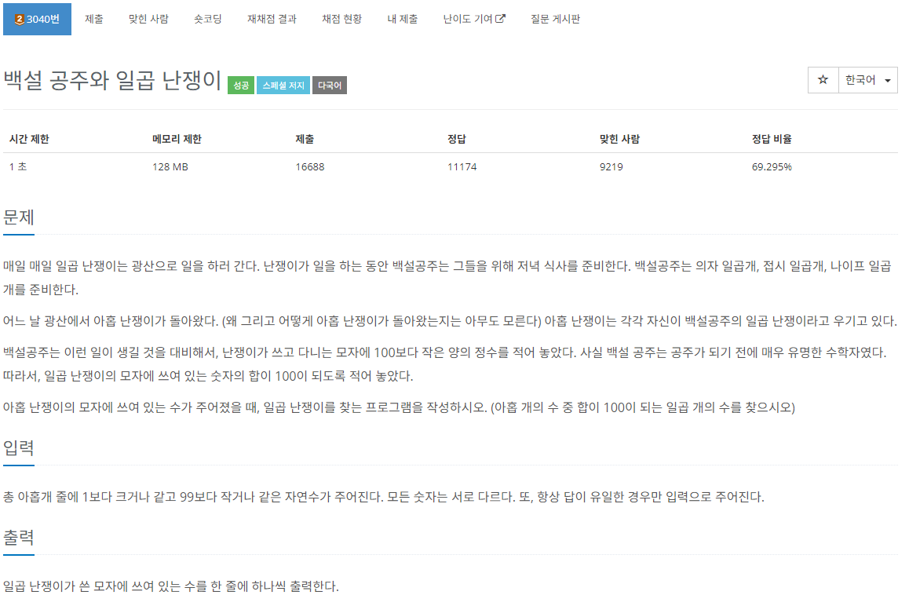
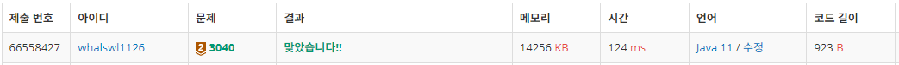

# 백설 공주와 일곱 난쟁이

[url](https://www.acmicpc.net/problem/3040)

> 브루트포스



---

조합문제이다.

입력받을 때 동시에 모든 합을 먼저 구한 뒤 그 중 2개의 조합의 합을 빼서 100이 나오는지 확인하면 되는 코드이다.

---

```java
import java.io.BufferedReader;
import java.io.IOException;
import java.io.InputStreamReader;

public class Main_3040_백설공주와일곱난쟁이 {
	static int sum, input[], stranger[];
	public static void main(String[] args) throws IOException {
		BufferedReader br = new BufferedReader(new InputStreamReader(System.in));

		input = new int[9];
		stranger = new int[2];
		sum = 0;

		for (int i = 0; i < 9; i++) {
			input[i] = Integer.parseInt(br.readLine());
			sum += input[i];
		}

		comb(0, 0);
	}
	private static void comb(int cnt, int start) {
		if(cnt == 2) {
			if(sum - stranger[0] - stranger[1] == 100) {
				for (int nanjang : input) {
					if(nanjang != stranger[0] && nanjang != stranger[1])
						System.out.println(nanjang);
				}
				System.out.println();
			}
			return;
		}
		for (int i = start; i < 9; i++) {
			stranger[cnt] = input[i];
			comb(cnt+1, i+1);
		}
	}
}
```

---


