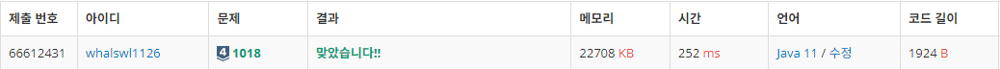

# 체스판 다시 칠하기

> 브루트포스


---

자신있었던 사방탐색이었는데 오랜만에 푸니까 엄청 버벅거렸다

---

```java
import java.io.BufferedReader;
import java.io.IOException;
import java.io.InputStreamReader;
import java.util.StringTokenizer;

public class Main {
	static int N, M, cnt, result = Integer.MAX_VALUE;
	static char[][] board, map;
	static int[] dr = { -1, 0, 1, 0 };
	static int[] dc = { 0, 1, 0, -1 };
	static boolean[][] visited;
	public static void main(String[] args) throws IOException {
		BufferedReader br = new BufferedReader(new InputStreamReader(System.in));
		StringTokenizer st = new StringTokenizer(br.readLine());

		N = Integer.parseInt(st.nextToken());
		M = Integer.parseInt(st.nextToken());
		board = new char[N][M];
		map = new char[8][8];

		for (int i = 0; i < N; i++) {
			String str = br.readLine();
			for (int j = 0; j < M; j++) {
				board[i][j] = str.charAt(j);
			}
		}

		for (int i = 0; i <= N - 8; i++) {
			for (int j = 0; j <= M - 8; j++) {

				visited = new boolean[8][8];
				copyMap(i,j);
				cnt = 0;
				for (int r = 0; r < 8; r++) {
					for (int c = 0; c < 8; c++) {
						dfs(r, c);
					}
				}
				result = Math.min(result, cnt);

				visited = new boolean[8][8];
				copyMap(i,j);
				change(0,0);
				cnt = 1;
				for (int r = 0; r < 8; r++) {
					for (int c = 0; c < 8; c++) {
						dfs(r, c);
					}
				}
				result = Math.min(result, cnt);
			}
		}
		System.out.println(result);
	}
	private static void copyMap(int r, int c) {
		for (int i = 0; i < 8; i++)
			for (int j = 0; j < 8; j++)
				map[i][j] = board[i + r][j + c];
	}
	private static void dfs(int r, int c) {
		visited[r][c] = true;

		for (int d = 0; d < 4; d++) {
			int nr = r + dr[d];
			int nc = c + dc[d];

			if(0 > nr || nr >= 8 || 0 > nc || nc >= 8 || visited[nr][nc] || map[r][c] != map[nr][nc])
				continue;

			cnt++;
			change(nr, nc);
			dfs(nr, nc);
		}
	}
	private static void change(int r, int c) {
		if(map[r][c] == 'W')
			map[r][c] = 'B';
		else
			map[r][c] = 'W';
	}
}
```

---


