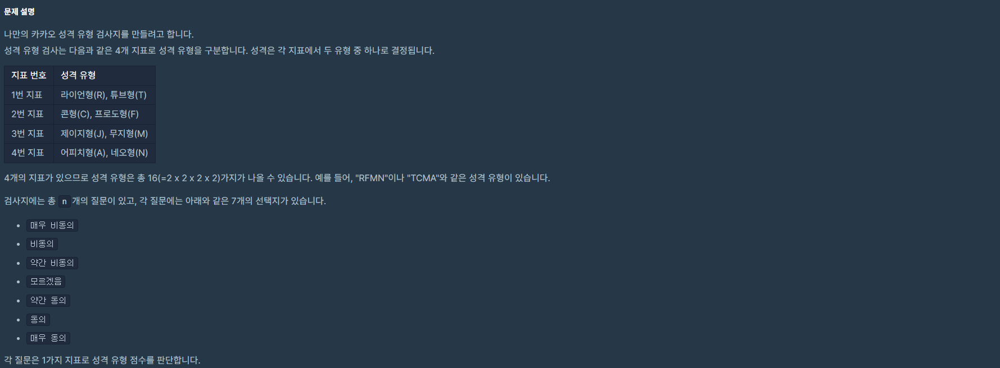
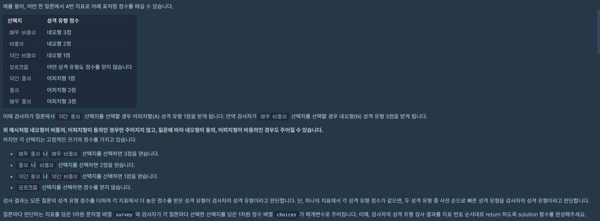
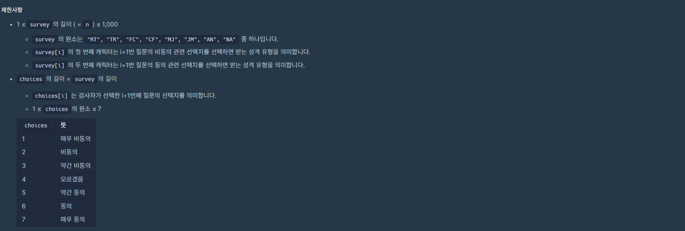
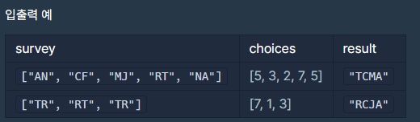

# 성격 유형 검사하기

> 2022 KAKAO TECK INTERNSHIP





---



---



---

map을 이용하여 결과지를 만들고 값은 모두 0으로 저장

설문 결과의 choices[i]의 값이 4을 뺐을 때가 점수이고

점수가 음수면 앞 유형, 양수면 뒷 유형인 규칙이 있다.

---

```java
import java.io.*;
import java.util.*;

class Solution {
    public String solution(String[] survey, int[] choices) {
        Map<String, Integer> result = new HashMap<>();
        int N = survey.length;

        result.put("R", 0);
		result.put("T", 0);
		result.put("C", 0);
		result.put("F", 0);
		result.put("J", 0);
		result.put("M", 0);
		result.put("A", 0);
		result.put("N", 0);

        //설문결과
        int score;
		for (int i = 0; i < N; i++) {
			score = choices[i] - 4;

			if(score < 0)
				result.put(survey[i].substring(0, 1), result.get(survey[i].substring(0, 1)) + Math.abs(score));
			else if(score > 0)
			    result.put(survey[i].substring(1), result.get(survey[i].substring(1)) + Math.abs(score));
		}

        //점수계산
        StringBuilder sb = new StringBuilder();

		sb.append(result.get("R") >= result.get("T") ? "R" : "T");
		sb.append(result.get("C") >= result.get("F") ? "C" : "F");
		sb.append(result.get("J") >= result.get("M") ? "J" : "M");
		sb.append(result.get("A") >= result.get("N") ? "A" : "N");

		return sb.toString();
    }
}
```

---

- Eclipse
  ```java
  package kakao_tech_intership_2022;

  import java.io.BufferedReader;
  import java.io.IOException;
  import java.io.InputStreamReader;
  import java.util.HashMap;
  import java.util.Map;
  import java.util.StringTokenizer;

  /*
  5
  ["AN", "CF", "MJ", "RT", "NA"]
  [5, 3, 2, 7, 5]
  3
  => TCMA
  ["TR", "RT", "TR"]
  [7, 1, 3]
  => RCJA
  */
  public class 성격유형검사하기 {
  	static String[] survey;
  	static int N, choices[];
  	static Map<String, Integer> result = new HashMap<>();

  	public static void main(String[] args) throws IOException {
  		// 질문 개수 입력받기
  		BufferedReader br = new BufferedReader(new InputStreamReader(System.in));
  		N = Integer.parseInt(br.readLine());

  		// 초기화
  		survey = new String[N];
  		choices = new int[N];

  		// 입력받기
  		String s = br.readLine();
  		s = s.replaceAll("[^a-zA-Z]", " ");
  		StringTokenizer st = new StringTokenizer(s);
  		for (int i = 0; i < N; i++) {
  			survey[i] = st.nextToken();
  		}

  		String c = br.readLine();
  		c = c.replaceAll("[^0-9]", " ");
  		st = new StringTokenizer(c);
  		for (int i = 0; i < N; i++) {
  			choices[i] = Integer.parseInt(st.nextToken());
  		}

  		result.put("R", 0);
  		result.put("T", 0);
  		result.put("C", 0);
  		result.put("F", 0);
  		result.put("J", 0);
  		result.put("M", 0);
  		result.put("A", 0);
  		result.put("N", 0);

  		// 설문결과
  		Result();

  		// 점수계산
  		System.out.println(Score());

  	}

  	private static String Score() {
  		StringBuilder sb = new StringBuilder();

  		sb.append(result.get("R") >= result.get("T") ? "R" : "T");
  		sb.append(result.get("C") >= result.get("F") ? "C" : "F");
  		sb.append(result.get("J") >= result.get("M") ? "J" : "M");
  		sb.append(result.get("A") >= result.get("N") ? "A" : "N");

  		return sb.toString();
  	}

  	private static void Result() {
  		int score;
  		for (int i = 0; i < N; i++) {
  			score = choices[i] - 4;

  			if (score < 0)
  				result.put(survey[i].substring(0, 1), result.get(survey[i].substring(0, 1)) + Math.abs(score));
  			else if (score > 0)
  				result.put(survey[i].substring(1), result.get(survey[i].substring(1)) + Math.abs(score));
  		}
  	}
  ```
